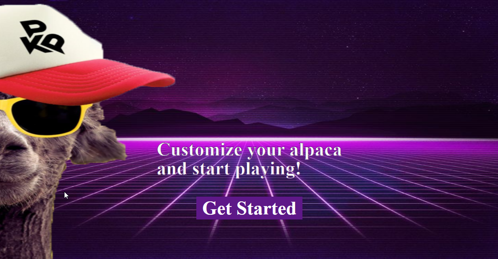
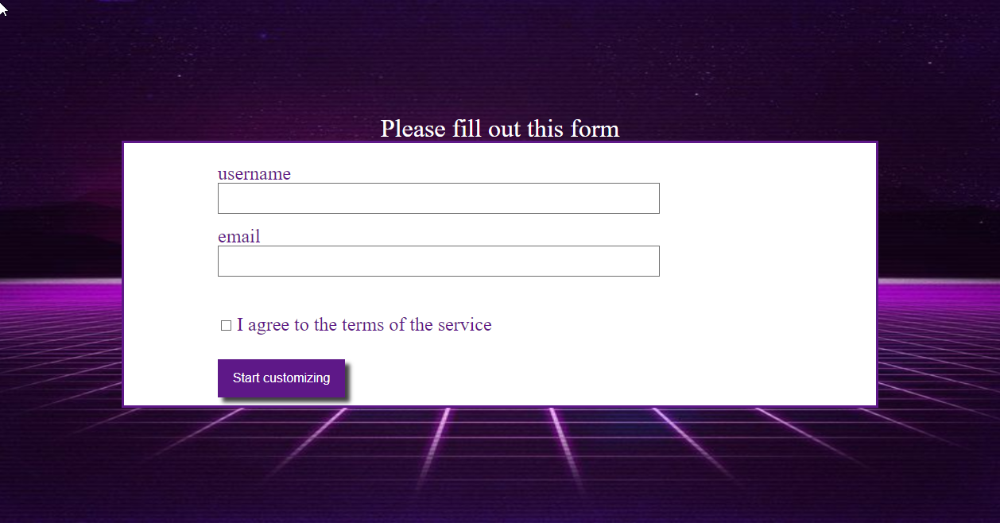
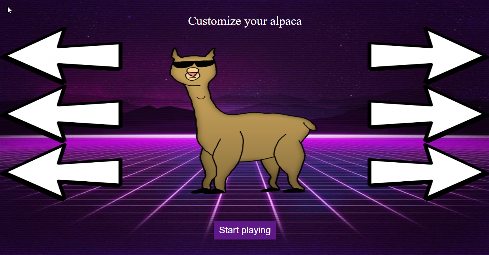
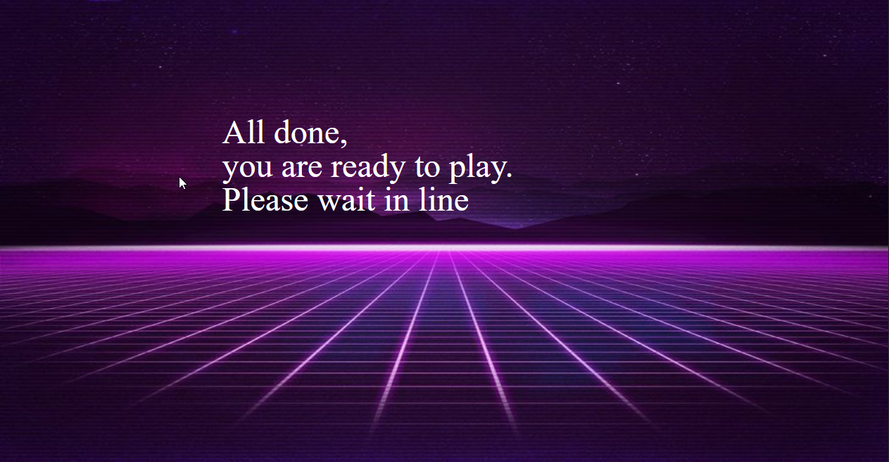

# alpaca_game_ucll

## Eerste aanzet tot pseudo 3d

We zijn begonnen met het implementeren van raycasting en floorcasting om een pseudo 3d surface/map te renderen.
Allereerst is het belangrijk om pygame te gebruiken en te initialiseren. Dit gebeurd door de lijn code: 
```python 
pygame.init()
```
Binnen het framework pygame kunnen we ook vormen creëren en sprites inladen. In ons geval hebben we in de eerste versie enkel een statische alpaca gerendered. Later worden hier zeker nog animaties aan toegevoegd.

Een voorbeeld van het inladen van een statische sprite is: 
```python
pygame.image.load('sprites/stripes.png')
```
Zo hebben we een *player, surface en straat* ingeladen. Deze sprites werden opgeslaan in een variabele waarvan we de waarden zo manipuleren om een 3d effect te creëren. 

De game runned door een **while loop**. Deze while loop zal blijven runnen zolang zijn waarde True blijft. Als deze waarde op False gezet word dan zal het spel gesloten worden. Het doel van deze loop is om het verloop van het spel vast te leggen. Door deze loop te manipuleren kunnen we het spel stopzetten en een start menu tonen, een game over scherm tonen en verschillende andere features. 


## Toevoegingen 22/07/2020

Nieuwe refractor van de wiskunde, vergemakkelijkt het spawnen van objecten en het maken van de maps. (Nog steeds buggy en incomplete, grootste uitdaging binnen het project)

Website voor het customizen van de alpace gelinked aan een persoonlijk account. Dit in een prive repository vanwege security reasons (Databank credentials, etc.)
Basis voor customization is werkende, User word aangemaakt in de Databank, en zijn/haar gekozen customization word in de databank opgeslagen. 






Bij het opstarten van de game word een scherm getoont waar de speler zijn gekozen username moet ingeven. Bij een correct ingevoerde username zal de game van start gaan, en de data die de customization bevat word doorgegeven aan de game. Bij een niet bestaande username word het spel niet gestart en een error message word getoont 
Volgende stap in dit onderdeel is het tekenen van de customization op het scherm (Challenge = Optimalisatie en goede methode om dit te implementeren).
*** sound effects for some fun :D


